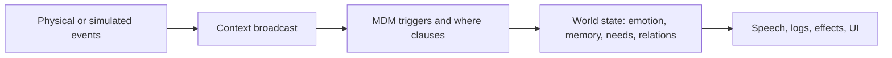

# MDS — Meaning-Driven Simulation


MDS is a deterministic semantic substrate for small living worlds: entities, memory, emotion, physics, language, and context in one TypeScript runtime.

It keeps the original dream alive — JSON that bows before meaning — but the working model is practical now: feed context in, let authored `.mdm` materials interpret it, and read a stable world log out.

---

## What it is

- **A world runtime** for entities that carry memory, needs, emotion, relations, and language.
- **A semantic bus** via `world.broadcastContext()` for feeding HomeLog-like facts, sensor readings, or game events into the world.
- **A material system** where behavior is declared in `.mdm` instead of scattered through imperative glue.
- **A sandbox for emergent language**: proto words, dialogue categories, lexicon learning, and multilingual responses can evolve under test.
- **A practical engine**: headless Node, browser ESM bundles, deterministic snapshots, and readable logs.

## What it is not

- Not a chatbot runtime.
- Not a cloud-only AI service.
- Not a hidden automation engine that guesses missing semantic truth.
- Not a replacement for DreamFlow/HomeLog. MDS is the shared world state those systems can feed and observe.

---

## Quick start

```bash
npm install @v1b3x0r/mds-core
```

```js
import { World } from '@v1b3x0r/mds-core'

const world = new World({
  features: {
    ontology: true,
    history: true,
    communication: true,
    linguistics: true,
    physics: true,
    rendering: 'headless'
  }
})

world.broadcastContext({
  'env.temp.c': 33.5,
  'env.humidity': 0.72,
  'env.light.lux': 18000,
  'env.noise.db': 38
})

console.log(world.logger.tailText(10).join('\\n'))
```

`broadcastContext()` is the bridge: HomeLog can say "humidity rose", DreamFlow can say "this tends to feel heavy", and MDS can let entities react through authored material.

---

## Core loop



The engine stays deterministic. If an LLM helps, it should author or validate material before runtime; the tick loop itself should not depend on an LLM call.

---

## Entity example

MDS still has room for the weird little soul of the project:

- **orz** can be a seed that reacts to climate, speaks emoji/proto first, and slowly grows a lexicon.
- **Athena** can be a patient dictionary entity that listens, learns translations, and writes memory.
- A HomeLog room can be a space where a lamp, fridge, gate, and bedroom door all perceive the same context differently.

That is the point: the same context frame can become different meanings depending on the entity that receives it.

---

## Feature map

| Area | What it gives you |
|------|-------------------|
| Entities | identity, position, memory, needs, emotion, relations |
| Semantic Bus | `broadcastContext()` for sensor/game/narrative facts |
| Materials | `.mdm` declarations for triggers, speech, memory, and effects |
| Dialogue | authored categories, weighted variants, no invented fallback truth |
| Proto-language | generated utterances from the active vocabulary pool |
| Physics | collision, energy transfer, fields, resonance hooks |
| World Mind | grief, vitality, tension, harmony, climate influence |
| Logger | readable stream for UI, debugging, dashboards, and tests |
| Performance | spatial grid optimization for larger worlds |

---

## HomeLog / DreamFlow fit

MDS is best treated as the semantic substrate:

```text
Physical world -> HomeLog facts -> DreamFlow causality -> MDS world state -> companions/UI
```

HomeLog should capture reality. DreamFlow should express causal behavior. MDS should hold the shared semantic state that observers and companions can live inside.

---

## Startup diagnostics

`World` is quiet by default. To inspect optional subsystem startup:

```js
const world = new World({
  silent: false,
  features: { communication: true, linguistics: true, rendering: 'headless' }
})
```

Use `world.logger` for structured runtime events; direct console startup messages are opt-in.

---

## Performance

v5.10.0 introduced spatial grid proximity queries:

| Scenario | Before | After |
|----------|--------|-------|
| 100 entities | 1.37ms | 0.20ms |
| 500 entities | ~11ms | ~0.35ms |

This moves interaction checks from broad O(N²) scans toward cell-based O(N*k) behavior for larger worlds.

---

## Docs

- [Reference](./docs/REFERENCE.md) — API and MDM details
- [Cookbook](./docs/COOKBOOK.md) — practical examples
- [Semantic-first MDM](./docs/MDM-SEMANTIC-FIRST.md) — material authoring doctrine
- [Core layers](./docs/CORE-LAYERS.md) — architecture map
- [Philosophy](./docs/PHILOSOPHY.md) — why this exists
- [Changelog](./docs/CHANGELOG.md)

Made in Chiang Mai, Thailand. MIT License.
